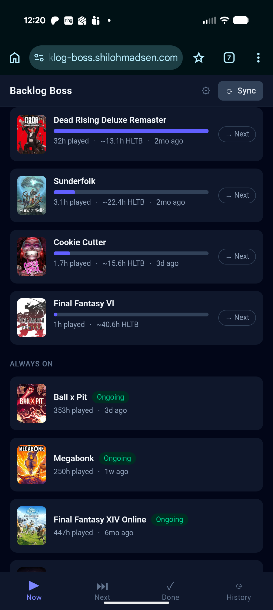
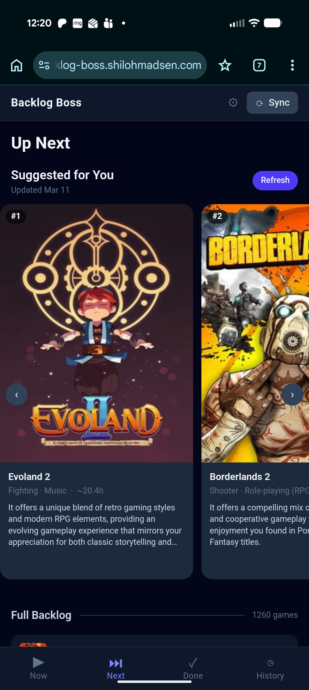
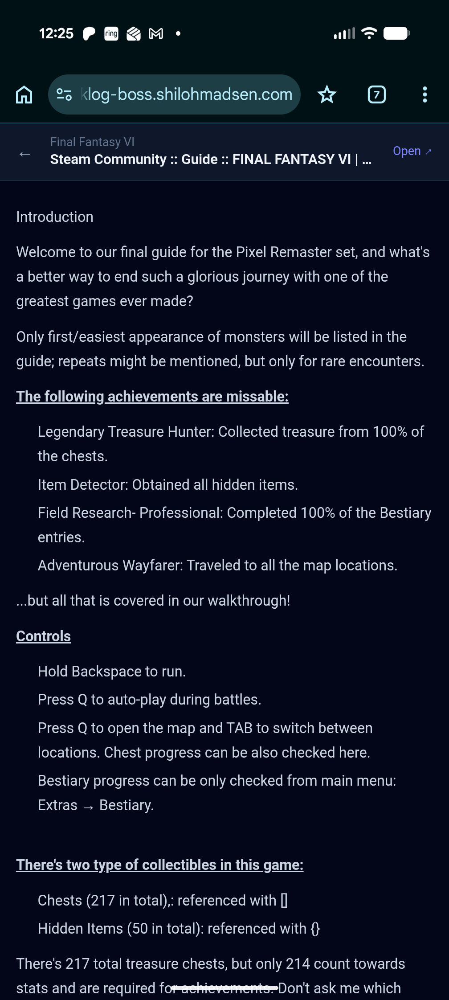

# Backlog Boss

A self-hosted game backlog manager with a taste-aware suggestion engine. Built for people with large Steam libraries and decades of gaming history who want help answering the question: *what should I play next?*



---

## What It Does

**Now** — Your in-progress games, sorted by proximity to completion using HowLongToBeat benchmarks. At a glance you can see which games you're closest to finishing.



**Next** — Your unplayed backlog, ranked by an LLM that knows your taste. Every suggestion comes with a plain-language explanation of why it fits you specifically, based on your ratings, tags, and play history.

**Done** — Completed games with your ratings and exit interview notes. The foundation the taste engine learns from.

**History** — Every game you've ever played, regardless of platform or when. Log PS5 games, Switch games, games from years before Steam. The taste engine uses all of it.



**Guide Reader** — Attach walkthrough guides to any game. Guides are fetched, cleaned with Mozilla Readability, and stored locally for offline reading. Scroll position is saved so you pick up exactly where you left off.

---

## Key Features

- **Steam library sync** — pulls your full library, playtime, and last-played dates
- **IGDB enrichment** — canonical game metadata (genres, themes, cover art, similar games)
- **HLTB completion benchmarks** — Main + Extras hours cached per game, progress bar in Now view
- **LLM suggestions** — embedding-based ranking + per-game explanations; fully async, never blocks the UI
- **Multi-user** — data layer is fully user-scoped; auth via Cloudflare Zero Trust (no app-level passwords)
- **PWA** — installable on iOS/Android home screen, offline browsing for library and guides
- **Data quality tools** — manual HLTB and IGDB triage for unmatched games
- **Guide source search** — searches StrategyWiki, TrueAchievements, TrueTrophies in parallel; paste content mode for bot-protected sites (GameFAQs etc.)
- **Ongoing / backburner statuses** — live service games and explicitly deferred games handled separately from the main backlog

---

## Tech Stack

| Layer | Choice |
|---|---|
| Runtime | Node.js 22 |
| Frontend | React 19 + Tailwind CSS v4 (PWA) |
| Database | SQLite via `node:sqlite` (Node 22 built-in — no native compilation) |
| LLM | Configurable — defaults to Ollama (`qwen2.5:14b` + `nomic-embed-text`) |
| Hosting | Docker container |
| Auth | Cloudflare Zero Trust (optional in dev) |

---

## LLM Configuration

The taste engine uses two models:
- **Embedding model** — generates vector representations of games for similarity ranking (`nomic-embed-text` by default)
- **Inference model** — writes the plain-language explanation for each suggestion (`qwen2.5:14b` by default)

Both are configured via environment variables and point at an Ollama-compatible endpoint by default. Ollama is recommended for self-hosters who want fully local inference with no API costs.

**Ollama model recommendations by hardware:**

| Hardware | Inference model | Notes |
|---|---|---|
| 16GB+ RAM / decent GPU | `qwen2.5:14b` | Best quality, ~9GB |
| 8GB RAM | `qwen2.5:7b` | Good quality, ~4GB |
| Low-powered NAS / CPU only | `qwen2.5:3b` | Faster, lower quality |

The embedding model (`nomic-embed-text`) is small (~274MB) and runs well on any hardware.

**Using a cloud LLM instead of Ollama** is a future roadmap item — the LLM layer is designed to be swappable. If you want to contribute, the integration points are `src/server/services/ollama.js` (inference + embedding) and `src/server/services/embeddings.js` (ranking logic). A provider-agnostic interface that supports Ollama, Claude, OpenAI, and others would be a welcome addition.

---

## Requirements

**To run:**
- Docker
- Ollama running somewhere accessible (local machine or NAS host) with your chosen models pulled
- A [Steam API key](https://steamcommunity.com/dev/apikey) and your 64-bit Steam ID
- [IGDB / Twitch API credentials](https://api-docs.igdb.com/#account-creation) (free)

**For multi-user / remote access (optional):**
- Cloudflare Zero Trust tunnel with Access policy

**For local development:**
- Node.js 22+
- npm

---

## Setup

### 1. Clone and install

```bash
git clone https://github.com/MydKnight/backlog-boss.git
cd backlog-boss
npm install
```

### 2. Configure environment

```bash
cp .env.example .env
```

Edit `.env` with your credentials:

```env
STEAM_API_KEY=your_steam_api_key
STEAM_ID=your_64bit_steam_id

IGDB_CLIENT_ID=your_twitch_client_id
IGDB_CLIENT_SECRET=your_twitch_client_secret

OLLAMA_ENDPOINT=http://localhost:11434
OLLAMA_MODEL=qwen2.5:14b
OLLAMA_EMBED_MODEL=nomic-embed-text

DATABASE_PATH=./data/backlog.db
PORT=3000
NODE_ENV=development
```

### 3. Run in development

```bash
npm run dev
```

The React dev server runs on `http://localhost:5173` (proxies API calls to `:3000`). The backend runs on `http://localhost:3000`.

In development mode, Cloudflare auth is bypassed — the first user in the DB is always used.

---

## Docker Deployment

### 1. Build the image

```bash
docker build -t backlog-boss .
```

The Dockerfile is multi-stage — React is built inside the container, no local build step needed.

### 2. Configure your compose environment

The `docker-compose.yml` uses variable substitution. Create a `.env` file alongside it:

```env
DOCKERDIR=/your/docker/path

STEAM_API_KEY=your_key
STEAM_ID=your_steam_id
IGDB_CLIENT_ID=your_id
IGDB_CLIENT_SECRET=your_secret
OWNER_EMAIL=your@email.com
```

`OWNER_EMAIL` links the first user row to your Cloudflare Access identity on startup. Required for production auth to work correctly.

### 3. Start

```bash
docker compose up -d
docker logs backlog-boss
```

Look for `Owner account linked to your@email.com` in the logs to confirm the DB and auth are wired correctly.

---

## First Run

1. **Sync your library** — hit the sync button (top right). This runs Steam → IGDB → HLTB in sequence. Expect a few minutes for a large library.
2. **Log some history** — go to the History tab and log games you've already played with ratings. The taste engine needs these signals to work well.
3. **Generate suggestions** — go to the Next view and hit Refresh. The engine will embed your library and generate ranked suggestions with explanations. This runs in the background — it can take several minutes on CPU-only hardware.
4. **Read guides** — open any game, tap the guide icon, search or paste a URL.

New users see an onboarding screen to enter their Steam credentials on first login.

---

## Multi-User

Each user's library, history, guides, and taste snapshots are fully isolated. New users who reach the app through Cloudflare Access see the onboarding screen to connect their Steam account.

The taste inference job is shared infrastructure — one job runs at a time across all users. For a small trusted circle this is fine in practice.

---

## Design Docs

For the full picture:

- [`PROJECT_BRIEF.md`](PROJECT_BRIEF.md) — scope, phase plan, product decisions
- [`DATA_MODEL.md`](DATA_MODEL.md) — complete database schema with rationale
- [`API_INTEGRATION_NOTES.md`](API_INTEGRATION_NOTES.md) — Steam, IGDB, HLTB, Ollama, Readability integration contracts
- [`CLAUDE.md`](CLAUDE.md) — architecture rules, coding conventions, phase completion checklists

---

## Notes

- **HLTB** uses an unofficial npm package that occasionally breaks. All access is isolated to `src/server/services/hltb.js` — when it breaks, that's the only file to fix.
- **Ollama inside Docker** — use `http://host.docker.internal:11434` as the endpoint, not `localhost`. The `docker-compose.yml` includes the `extra_hosts` entry to make this work.
- **GameFAQs guides** — Cloudflare bot protection blocks server-side fetches. Use the Paste Content mode: open the guide page, view source (Ctrl+U), select all, copy, paste into the app.
- The taste engine is **async and cached** — suggestions are never generated in a page load. Hit Refresh, wait, come back.

---

## Roadmap

- [ ] Provider-agnostic LLM interface (Ollama, Claude, OpenAI, etc.)
- [ ] Single shared Steam API key option for multi-user installs
- [ ] Achievement % as a completion signal (Steam API already integrated, just needs wiring)
- [ ] Automated deploy workflow
